# ShinkaEvolve: Towards Open-Ended And Sample-Efficient Program Evolution

Robert Tjarko Lange, Yuki Imajuku and Edoardo Cetin Sakana AI

We introduce ShinkaEvolve1: a new open-source framework leveraging large language models (LLMs) to advance scientific discovery with state-of-the-art performance and unprecedented efficiency. Recent advances in scaling inference time compute of LLMs have enabled significant progress in generalized scientific discovery. These approaches rely on evolutionary agentic harnesses that leverage LLMs as mutation operators to generate candidate solutions. However, current code evolution methods suffer from critical limitations: they are sample inefficient, requiring thousands of samples to identify effective solutions, and remain closed-source, hindering broad adoption and extension. ShinkaEvolve addresses these limitations, introducing three key innovations: a parent sampling technique balancing exploration and exploitation, code novelty rejection-sampling for efficient search space exploration, and a banditbased LLM ensemble selection strategy. We evaluate ShinkaEvolve across diverse tasks, demonstrating consistent improvements in sample efficiency and solution quality. ShinkaEvolve discovers a new stateof-the-art circle packing solution using only 150 samples, designs high-performing agentic harnesses for AIME mathematical reasoning tasks, identifies improvements to ALE-Bench competitive programming solutions, and discovers novel mixture-of-expert load balancing loss functions that illuminate the space of optimization strategies. Our results demonstrate that ShinkaEvolve achieves broad applicability with exceptional sample efficiency. By providing open-source accessibility and cost-efficiency, this work democratizes open-ended discovery across diverse computational problems.

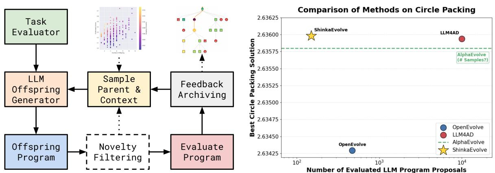  
Code https://github.com/SakanaAI/ShinkaEvolve   
Figure 1 | High-level overview of ShinkaEvolve. Left: The ShinkaEvolve framework constructs an archive of evaluated programs, rejection-samples new programs, and evaluates their fitness. Right: ShinkaEvolve provides a sample efficient alternative to AlphaEvolve and outperforms its Circle Packing solution.

# 1. Introduction

The rapid advancement of large language models (LLMs) has transformed scientific discovery through agentic systems that autonomously conduct experiments and test hypotheses (Lu et al., 2024b; Novikov et al., 2025; Yamada et al., 2025; Zhang et al., 2025). These frameworks leverage LLMs as sophisticated mutation operators, iteratively refining candidate solutions with successful variants propagating through successive generations. This methodology has proven effective across domains such as competitive programming (Li et al., 2022), mathematical optimization (Romera-Paredes et al., 2024), and automated agentic design (Hu et al., 2024). However, current implementations face significant practical limitations. The primary challenge is substantial sample inefficiency as existing approaches typically require thousands of evaluations, making them computationally expensive and time-consuming. This inefficiency stems from naive exploration strategies that fail to effectively leverage accumulated knowledge from previous generations. Additionally, most leading systems remain closed-source, creating barriers to reproducibility and limiting community-driven improvements. ShinkaEvolve addresses these challenges through three key algorithmic innovations that work synergistically to enhance sample efficiency. Our adaptive parent and LLM sampling intelligently balances exploration of novel regions with exploitation of known high-quality areas. Next, our code proposal novelty rejection sampling ensures efficient program mutations. Finally, our bandit-based LLM ensemble selection strategy dynamically adapts to the evolving state of the sampled archive parents and inspiration programs. Experimental validation across diverse domains demonstrates substantial improvements in both efficiency and solution quality, with ShinkaEvolve achieving state-of-the-art results using orders of magnitude fewer evaluations than existing approaches. By releasing our complete implementation as open-source software, we aim to democratize access to advanced evolutionary discovery tools and enable broad community contributions. In summary:

1. We introduce ShinkaEvolve, an evolutionary framework that substantially improves sample efficiency through three key algorithmic innovations: a novel parent program sampling strategy, code novelty rejection-sampling, and adaptive performance-based LLM ensemble selection. 2. We demonstrate ShinkaEvolve’s ability to innovate beyond human and LLM-generated solutions with comprehensive experimental validation across four distinct problem domains: mathematical optimization (circle packing), agentic design (AIME tasks), competitive programming (ALE-Bench), and LLM training design (mixture-of-expert load balancing loss). 3. We release ShinkaEvolve as open-source software under the Apache 2.0 license, including implementation details, and an interactive visualization tool for monitoring the search process.

# 2. Related Work

Evolutionary Code Optimization with LLMs. One particular flavor of test-time compute is evolutionary code optimization: the usage, mutation, and recombination of previously generated code to produce new samples. This approach has previously been used to optimize reward and preference objectives (Lu et al., 2024a; Ma et al., 2023), mathematical science code (Romera-Paredes et al., 2024), and other applications (Berman, 2025; Lange et al., 2024, 2025; Lehman et al., 2022; Meyerson et al., 2023). Through prompting, LLMs are used as recombination engines (Lange et al., 2023; Meyerson et al., 2023), and are capable of simulating crossover between diverse code snippets and the rationales that produced them. These types of program archive-building systems resemble a population-based LLM-guided tree search (Inoue et al., 2025; Jiang et al., 2025). Most closely related to our work are AlphaEvolve (Novikov et al., 2025), OpenEvolve (Sharma, 2025), and LLM4AD (Liu et al., 2024a). We advance this line of work, demonstrating unprecedented sample efficiency with our combination of rejection-sampling, LLM prioritization, and online meta-scratchpad drafting.

Open-Ended Agentic Discovery. The integration of LLMs with open-ended evolutionary principles enables agentic systems capable of continuous innovation (Stanley et al., 2017; Zhang et al., 2025).

Unlike traditional novelty search that relies on explicit diversity metrics (Lehman and Stanley, 2011; Lehman et al., 2008), LLM agents leverage learned representations to generate creative solutions while maintaining semantic coherence (Faldor et al., 2024; Hu et al., 2024; Novikov et al., 2025). These agents construct evolutionary trees of programs where LLM-guided mutations connect related solutions across generations (Lehman et al., 2020). ShinkaEvolve systematically combines stepping stones, suboptimal intermediate solutions that serve as building blocks for breakthrough innovations, by employing LLM agents to both generate mutations and evaluate program relationships, enabling successful patterns to rapidly propagate across search branches through recombination.

# 3. Method

Algorithm Overview. ShinkaEvolve’s control-flow entails three main phases:

1. Parent and inspiration sampling from an archive of island program subpopulations. Importantly, we emphasize the trade-off between exploration and exploitation in parent program selection. 2. Program mutation via LLM-guided code edit proposals. We utilize novelty rejection-sampling based on code embedding similarity and an LLM-as-a-novelty-judge assessment. 3. Program execution and world feedback guiding the LLM ensemble selection probabilities and online meta-scratchpad drafting for documentation and knowledge diffusion.

# 3.1. Parent and inspiration sampling

Archive Maintenance, Island Populations & Mutation Context Construction. ShinkaEvolve maintains a fixed-size archive of previously evaluated programs with fitness scores and meta information, implementing an elite size constraint. The mutation context incorporates a primary parent program alongside inspiration programs drawn from top-performing solutions and random archive samples, providing the LLM with diverse exemplars for creative recombination. We follow Novikov et al. (2025); Romera-Paredes et al. (2024) and employ an island model approach with independent subpopulations seeded from the same initial program. The islands evolve in parallel to enhance diversity and prevent premature convergence. Island members can occasionally migrate between islands to diffuse knowledge across “discovery substreams”. To protect the uniqueness of each island, we prevent the island-specific best-performing program from migrating (Romera-Paredes et al., 2024; Tanese, 1989). Sampling occurs hierarchically: with the island ID first sampled uniformly from the archive, later used as the origin for both parent and inspirations. Afterwards, we sample random archive programs and the top-K performing programs to use them as context programs.

Balancing Exploration & Exploitation: Parent Program Selection. Given an island subpopulation, ShinkaEvolve implements multiple different parent sampling strategies that balance exploration and exploitation: First, we employ power law sampling where programs are ranked by fitness with ranks ???? (???? = 1 for the best program). The selection probability follows ???? = $\begin{array} { r } { p _ { i } ~ = ~ \frac { r _ { i } ^ { - \alpha } } { \sum _ { j = 1 } ^ { n } r _ { j } ^ { - \alpha } } } \end{array}$ , where $\alpha$ controls exploitation intensity. Setting $\alpha = 0$ yields uniform sampling, while $\alpha \to \infty$ implements hill-climbing. Inspired by Zhang et al. (2025), we contrast this with weighted sampling, incorporating performance and novelty. Given programs with offspring count $N ( P _ { i } )$ , we first compute the median fitness $\alpha _ { 0 } = \mathrm { m e d i a n } ( \{ F ( P _ { 1 } ) , F ( P _ { 2 } ) , . . . , F ( P _ { n } ) \} )$ . The performance component uses sigmoid scaling: $s _ { i } = \sigma ( \lambda \cdot ( F ( P _ { i } ) - \alpha _ { 0 } ) )$ where $\begin{array} { r } { \sigma ( x ) = \frac { 1 } { 1 + e ^ { - x } } } \end{array}$ and $\lambda$ controls selection pressure. The novelty component $\begin{array} { r } { h _ { i } = \frac { 1 } { 1 + N ( P _ { i } ) } } \end{array}$ favors programs with fewer offspring. The final probability combines these: $\begin{array} { r } { p _ { i } = \frac { w _ { i } } { \sum _ { j = 1 } ^ { n } w _ { j } } } \end{array}$ where $w _ { i } = s _ { i } \cdot h _ { i }$ balances performance and novelty. The strategies are illustrated in Figure 2.

# 3.2. Program mutation and novelty assessment

LLM-Guided Program Mutations. To generate new programs, ShinkaEvolve starts by sampling a specific LLM and a set of sampling parameters (e.g., temperature or reasoning budget) from a pre-specified pool. Our framework provides support for models from leading API providers, including GPT, Gemini, Claude, and DeepSeek (Anthropic, 2024; Guo et al., 2025; OpenAI, 2023; Team, 2025). After sampling a model, ShinkaEvolve employs three distinct mutation approaches to foster diversity and creativity in the LLM-generated program variants:

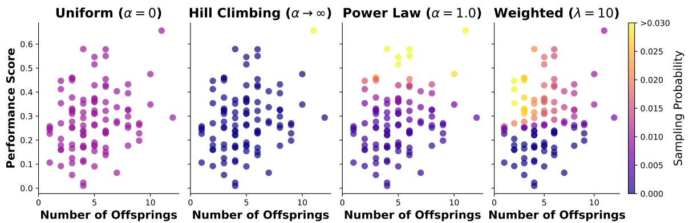  
Figure 2 | ShinkaEvolve Parent Sampling. The strategies range from pure exploration (uniform sampling) to pure exploitation (hill-climbing) to a combination of performance and novelty.

1. Diff-Based Edits. We implement diff edits using LLMs following the approach outlined in Novikov et al. (2025), utilizing SEARCH/REPLACE blocks for targeted modifications. 2. Full Rewrites. We enable full program rewrites to allow greater flexibility, programmatically ensuring that non-mutable blocks remain unchanged during the LLM rewrite process. 3. Crossover Mutation. We leverage crossover mutations (Lange et al., 2025; Lehman et al., 2022) where an additional archive program is sampled and an LLM is prompted to combine programs.

Following Novikov et al. (2025), we use text markers (EVOLVE-BLOCK-START & EVOLVE-BLOCK-END) to ensure that immutable code is left unchanged during the LLM rewrite process. After obtaining a code change proposal, we enforce that the immutable code is not touched and resample a new proposal if a patch is invalid, providing parsing feedback using Reflexion (Shinn et al., 2024).

Program Diversity via Novelty Rejection Sampling. To enhance the creativity of executed code proposals, we leverage a foundation model ensemble combined with temperature sampling. Additionally, we introduce code novelty rejection sampling using an embedding model to embed mutable parts of the program code. Afterwards, we compute cosine similarity scores across the island subpopulation programs. If the maximal score exceeds a threshold (e.g., $\eta = 0 . 9 5 )$ ), we query an LLM to further assess whether the program is meaningfully different. The approach is illustrated in Figure 3.

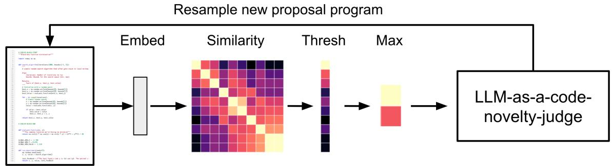  
Figure 3 | ShinkaEvolve Program Novelty Rejection Sampling. ShinkaEvolve embeds mutable code snippets, computes similarities across the archive; if the maximal score exceeds a threshold, another LLM is queried to assess whether the program is meaningfully novel.

# 3.3. Execution and world feedback

Multi-Objective Optimization & Textual Feedback. After a program obtained with the above steps is executed, ShinkaEvolve performs multi-objective assessment yielding both its scalar fitness value $r _ { i }$ together with a set of exposed “public metrics” and textual feedback. ShinkaEvolve then stores this full multi-objective assessment in the population archive to provide an informative context for future generations of language model mutations using a simple prompting format:

# Example of Diff Edit Prompt with Textual Feedback

# Current program   
Here is the current program we are trying to improve (you will need to propose a modification to it below): \`\`\`{language}   
{code_content}   
  
Here are the performance metrics of the program:   
{performance_metrics}{text_feedback_section}   
# Instructions   
...   
# Task   
IMPORTANT: Do not rewrite the entire program - focus on targeted improvements.

Adaptive LLM sampling evolution. The performance of different LLMs to propose mutations can vary across problem domains and based on the current state of the sampled archive parents and inspiration programs. ShinkaEvolve dynamically adapts to this non-stationarity by evolving the LLM sampling probability throughout at the end of each generation. Our approach is based on the UCB1 algorithm (Auer et al., 2002), associating each LLM with a visitation counter and an estimate of the expected score updated with the performance of its sampled mutations. We introduce changes tailored to the domain of LLM-driven discovery. In particular, rather than the absolute fitness of each mutation $r _ { i } ,$ we update the LLM distribution using: $r _ { i } ^ { u } = \exp ( \operatorname* { m a x } ( r _ { i } - r _ { i } ^ { b } , 0 ) ) - 1$ , where $r _ { i } ^ { b }$ is the baseline reward for program ?? computed as the maximum between its parent program and the initial program in the database, ensuring each LLM is evaluated based on its relative improvement to account for the non-stationarity of the program archive. At the same time, the $\exp ( \cdot )$ and $\operatorname* { m a x } ( \cdot , 0 )$ operations help precisely promote LLMs able to come up with bold, high-risk, high-reward mutations, over “safer” minor improvements. We use the tracked statistics over the observed rewards to normalize $r _ { i } ^ { u }$ and ensure invariance to the fitness scale of each domain.

Meta-Scratchpad & Online Refinement. ShinkaEvolve implements a meta-scratchpad system that periodically analyzes successful solutions to accelerate learning. Every $T$ generations, we summarize the recent program evaluations and identify common optimization strategies and design principles. The meta-agent synthesizes insights into actionable recommendations appended to the mutation prompt, providing high-level guidance from accumulated evolutionary experience. The approach is illustrated in Figure 4.

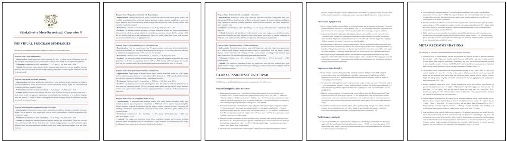  
Figure 4 | A ShinkaEvolve Meta-Scratchpad. It consists of individual program summaries, global insights, and implementation recommendations, which are appended to the mutation prompt.

# 4. Results

# 4.1. Circle Packing: Reproducing & Improving AlphaEvolve Results

Task Description. The circle packing optimization problem requires placing 26 circles within a unit square such that the sum of their radii is maximized while ensuring no circles overlap and all circles remain fully contained within the square boundary. This constrained optimization challenge combines discrete placement decisions with continuous radius optimization, making it a complex benchmark for evolutionary algorithms. The problem exhibits multiple local optima and requires sophisticated search strategies to discover high-quality solutions, as naive approaches often converge to suboptimal configurations with poor space utilization.

ShinkaEvolve’s Discovery Dynamics. ShinkaEvolve was evaluated over 150 evolutionary generations, demonstrating remarkable sample efficiency compared to existing approaches that typically require thousands of evaluations (Figure 1). Figure 5 (left) illustrates the improvement trajectory, exhibiting three distinct phases: an initial rapid improvement phase where the algorithm quickly discovers fundamental radii optimization strategies, a sustained exploration phase with incremental gains as more sophisticated techniques emerge (constraint-based optimization), and a final convergence phase where the best solutions are refined through restarts. The tree structure in Figure 5 (right) reveals how successful innovations propagate through the population, with highperforming solutions (shown in green and yellow) serving as parents for subsequent generations. Notably, the algorithm demonstrates sophisticated exploration patterns, with multiple evolutionary branches exploring different algorithmic approaches before converging toward the optimal solution path highlighted in black. We provide various ablation studies in Section 5.

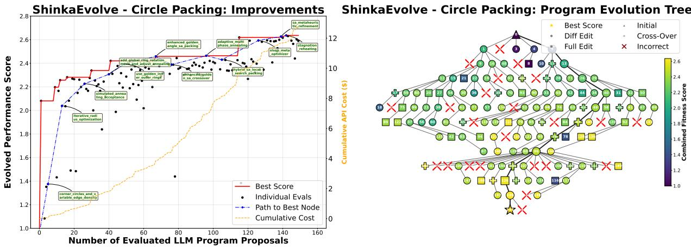  
Figure 5 | ShinkaEvolve on Circle Packing Task. Left: ShinkaEvolve outperforms AlphaEvolve’s solution within less than 150 program evaluations. Right: ShinkaEvolve’s program evolution tree demonstrates the iterative composition of stepping stones into high-performing solutions.

ShinkaEvolve’s Discovered Solution. The evolved algorithm (Section C.1) combines three key innovations: (1) a sophisticated initialization strategy that places circles in a structured goldenangle spiral pattern with strategic corner and edge positioning, (2) a hybrid optimization approach integrating SLSQP gradient-based refinement with simulated annealing for global exploration, and (3) intelligent perturbation mechanisms that alternate between local circle movements and global ring rotations to escape local optima. The discovered solution employs adaptive temperature scheduling with reheating strategies to prevent premature convergence, while maintaining feasibility through constraint-aware radius computation. This multi-level approach, from structured initialization through meta-heuristic exploration to gradient-based polishing, exemplifies how ShinkaEvolve can discover sophisticated algorithmic compositions that outperform hand-designed baselines.

# 4.2. AIME: Evolving Agent Scaffolds for Math Reasoning

Task Description. We evaluate ShinkaEvolve on AIME 2024 (AIM, 2024) mathematical reasoning problems, consisting of 30 challenging competition-level questions requiring sophisticated problemsolving strategies (Hu et al., 2024). The task involves evolving agent scaffold designs constrained to a maximum of 10 LLM queries per problem for computational efficiency. Using gpt-4.1-nano as the base model, we discover scaffold designs for 75 generations, with each candidate evaluated across three independent runs on the complete question set.

ShinkaEvolve’s Discovery Dynamics. The evolutionary process systematically explores prompting strategies, ensemble methods, and verification techniques to identify optimal agent architectures. ShinkaEvolve discovers scaffold designs that significantly outperform hand-designed baselines, including simple single-query agents and sophisticated majority-voting approaches. The search reveals a Pareto frontier between efficiency and performance (Figure 6, left), with 7 LLM queries yielding maximum performance while an alternative scaffold achieves comparable results using the full 10- query budget. Generalization experiments reveal important insights into the scaffold’s robustness. Evaluating on 2023 and 2025 AIME problems shows different transfer patterns (Figure 6, middle): smaller improvements on 2023 problems suggest potential saturation due to training data contamination, while larger gains on 2025 problems indicate successful generalization to recent, unseen challenges. Cross-LLM model transfer experiments validate robustness, with successful adaptation to gpt-4.1-mini, $\mathtt { g p t } ^ { - 4 . 1 }$ , and o4-mini demonstrating that discovered architectures capture generalizable strategies rather than model-specific optimizations (Figure 6, right).

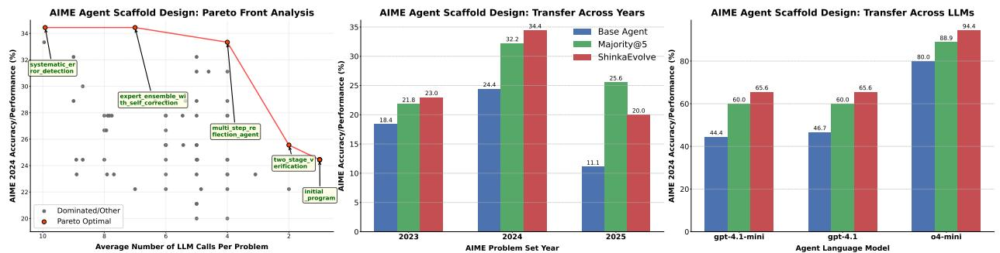  
Figure 6 | ShinkaEvolve for Agent Scaffold Design. Left: ShinkaEvolve discovers a Pareto frontier between performance and LLM query budget. Middle: The discovered scaffold generalizes to unseen AIME problems. Right: The scaffold improves performance regardless of the underlying LLM.

ShinkaEvolve’s Discovered Solution. The evolved agent implements a three-stage architecture leveraging diverse expert personas, critical peer review, and synthesis mechanisms. Three specialized experts generate independent solutions using distinct approaches: a meticulous step-by-step reasoner, an intuitive pattern-recognition specialist, and an algorithmic computer science-oriented mathematician, each operating at 0.7 temperature to balance creativity with reliability. The second stage introduces critical peer review, where each solution undergoes rigorous scrutiny from a skeptical reviewer at low temperature (0.1). The reviewer validates pattern-based reasoning by testing patterns on multiple examples, identifies logical flaws, and provides corrections when necessary, significantly improving solution quality. The final synthesis stage employs an editor-in-chief persona operating at zero temperature to analyze all solutions and critiques, identify the most reliable approach, and construct a canonical solution. Robust fallback mechanisms resort to majority voting among reviewed solutions, then original solutions, ensuring reliable output when components fail. This architecture effectively utilizes 7 LLM calls (3 generation $+ \ 3$ review $^ { + 1 }$ synthesis) within the 10-call constraint. The complete discovered agent scaffold can be found in Section C.2.

# 4.3. ALE-Bench: Evolving Programs for Combinatorial Optimization

Task Description. We apply ShinkaEvolve to the ALE-Bench LITE (Imajuku et al., 2025) benchmark, a collection of 10 competitive programming contests hosted by AtCoder and designed to test the performance of LLMs on heuristic problems. Here, we explore whether ShinkaEvolve can successfully improve high-performing solutions discovered by LLMs. We leverage the best programming solution discovered by ALE-Agent (Imajuku et al., 2025) as an initial program for each problem and apply ShinkaEvolve to improve on top of it. We run ShinkaEvolve for 50 generations, leveraging the score calculated on the public test set as the fitness function. Afterwards, we submit the best solution to the private test set and report the score.

ShinkaEvolve’s Discovery Dynamics. ShinkaEvolve is able to improve the solutions discovered by ALE-Agent by approximately $2 . 3 \%$ across the 10 tasks on average (Figure 7). Furthermore, on one task, ahc039, the combination of ShinkaEvolve with ALE-Agent resulted in the second place submission on the AtCoder leaderboard if they had participated. While these improvements resulted from detailed implementation improvements, we observe that the proposed changes by ShinkaEvolve remained algorithmically close to the original ALE-Agent’s initialization solution.

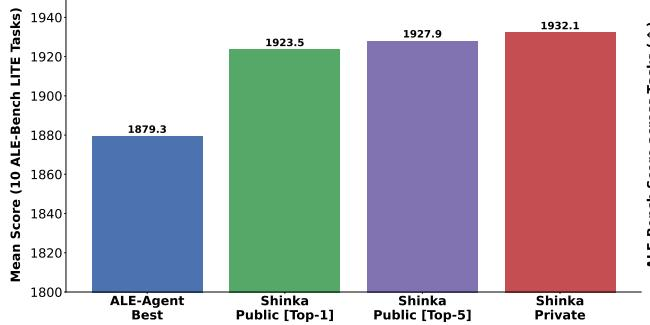  
ShinkaEvolve Improvements on Top of ALE-Agent Solutions

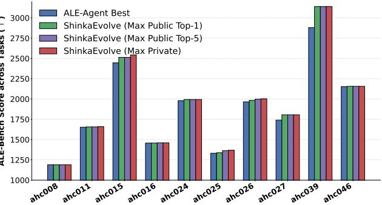  
ShinkaEvolve Private Performance Score (10 ALE-Bench Tasks)   
Figure 7 | ShinkaEvolve for Improving ALE-Bench solutions. Left: ShinkaEvolve improves the solutions discovered by ALE-Agent by $\sim 2 . 3 \%$ . Right: On one task, ahc039, the solution improved from 5th to 2nd place submission on the AtCoder leaderboard if it had participated in the contest.

ShinkaEvolve’s Discovered Solution. We focus on two tasks to illustrate the discovered improvements of ShinkaEvolve, ahc039 and ahc025. The objective of ahc039 is to find an optimal, axis-aligned polygon to maximize the number of mackerels it contains minus the number of sardines, subject to given constraints. The base solution by ALE-Agent applies simulated annealing with kd-tree data structure (5th, 2880 performance). ShinkaEvolve further improved the solution (2nd, 3140 performance) by introducing modifications such as caching the validation process and enhancing neighborhood operators. For the caching, the kd-tree was augmented to cache subtree statistics, including bounding boxes and fish counts, at each node. For the neighborhood operators, a novel “targeted edge move” was introduced, which heuristically identifies a misclassified fish (e.g., a mackerel outside the polygon) and greedily moves the nearest edge to correct its state. These changes strengthened the directionality of the search. For ahc025, the task is to use a balance scale to compare the total weights of any two subsets of items, aiming, after a fixed number of weighings, to partition the items into groups with as equal total weights as possible. ShinkaEvolve improved the ALE-Agent’s simulated annealing baseline by introducing faster caching, refining fallback weight estimation, and ultimately replacing simulated annealing with a more focused optimization combining greedy moves and targeted local search. Comparison with top human solutions suggests that for many tasks, there is ample room for improvement. Furthermore, often times ShinkaEvolve tended to explore modifications staying close to the ALE-Agent’s solution. This indicates the potential of overfitting to the initialization solution.

# 4.4. LLM Training: Evolving Losses for Balanced and Effective Experts

Task Description. The Mixture-of-Expert (MoE) architecture (Fedus et al., 2022; Lepikhin et al., 2020; Shazeer et al., 2017; Szymanski and Lemmon, 1993) has been a critical advancement, ubiquitous amongst modern open and closed-source flagship models (Google AI Blog, 2024; Guo et al., 2025; Meta-AI, 2025; Team, 2025; Yang et al., 2025). The basic idea is simple: replace traditional large feed-forward residual blocks with ensembles of efficient smaller modules (the “experts”) that can each specialize in distinct problem domains (Fedus et al., 2022). For each MoE layer and token, only the outputs of the top-K experts selected by a router classifier are computed, effectively splitting the computation and making both training and inference cheaper and faster. However, due to the non-differentiability of the top-K expert selection operation, it is critical to provide the router with an auxiliary load balancing loss (LBL), which serves to avoid early collapse toward uneven expert distribution of the token load. We deploy ShinkaEvolve precisely to tackle this open architectural design challenge, which has been one core focus driving recent MoE advancements (Dai et al., 2024; Du et al., 2022; Fedus et al., 2022; Muennighoff et al., 2024; Qiu et al., 2025; Shazeer et al., 2017; Xue et al., 2024; Zoph et al., 2022): Devising an effective load balancing loss to incentivize efficiency and specialization, without hindering the model’s expressivity.

ShinkaEvolve’s Discovery Dynamics. We ground the problem of LBL design by pretraining a MoE model with 556M parameters, $N _ { E } = 6 4$ total experts of which only $K = 8$ active for any given token. This results in only 82M parameters sparsely activated in each forward pass, excluding the token embeddings. We train this small model on over 2B tokens from fineweb (Penedo et al., 2024) by minimizing the MoE loss function adding the LBL, weighted by $\lambda = 0 . 0 1$ , to the model’s cross-entropy loss (CE). The fitness function of each program then measures a simple objective: minimize the sum of the final CE together with the model’s “load imbalance” as measured by the L1 deviation from a uniform distribution of tokens between the MoE experts. Given the cost of pretraining, we run ShinkaEvolve for only 30 iterations. We evaluate the generality of ShinkaEvolve’s best-performing solutions by training a much larger MoE with 2.7B parameters on slightly under 30B fineweb tokens across three LBL coefficients $\lambda \in 0 . 0 0 1$ , 0.01, 0.1, yielding different levels of regularization. We then compare with the “global-batch LBL” used to train some of the most popular open LLMs (Yang et al., 2025), in terms of final perplexity (Figure 8, left) and downstream task performance (Figure 8, center) as evaluated across seven different benchmarks (Bisk et al., 2020; Clark et al., 2018; Mihaylov et al., 2018; Sakaguchi et al., 2021; Sap et al., 2019; Talmor et al., 2018; Zellers et al., 2019). We provide our results below as a function of load imbalance, showing that ShinkaEvolve’s new loss achieves a consistent edge across our training configurations, growing larger with the value of the ?? coefficient.

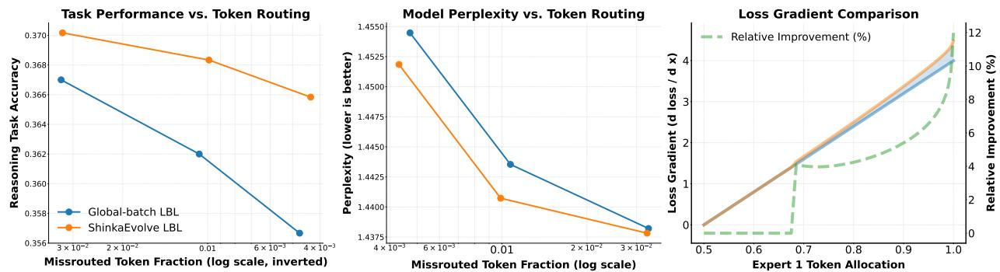  
Figure 8 | ShinkaEvolve for discovering Mixture-of-Experts Load Balancing Loss Functions. Left: Downstream task performance across seven benchmarks. Middle: Final perplexity across different missroute fractions. Right: Load imbalance gradient as a function of the token allocation.

ShinkaEvolve’s Discovered Solution. The discovered LBL is a new twist on the established global-batch LBL, which was used for seeding the evolutionary search. ShinkaEvolve complements this popular LBL with a new term, specifically targeted toward regularizing the MoE layers with individual under-specialized experts. Concretely, let $f _ { \ell , i }$ and $P _ { \ell , i }$ correspond to the selection frequency and the average router probabilities for each expert $i$ located in layer $\ell$ . ShinkaEvolve’s LBL uses a normalized complement to the entropy in each layer $\begin{array} { r } { s ( P _ { \ell } ) = 0 . 5 + \left( 1 - \frac { H \left( P _ { \ell } \right) } { \log N _ { E } } \right) } \end{array}$ and a minimum usage threshold target $\tau = 0 . 0 6 4 / N _ { E }$ to compute:

$$
L _ { \mathrm { L B L } } = N _ { E } \cdot \frac { 1 } { L } \sum _ { \ell = 1 } ^ { L } \sum _ { i = 1 } ^ { N _ { E } } f _ { \ell , i } P _ { \ell , i } + \frac { 0 . 1 } { L } \sum _ { \ell = 1 } ^ { L } s ( P _ { \ell } ) \sum _ { i = 1 } ^ { N _ { E } } \operatorname* { m a x } ( 0 , \tau - f _ { \ell , i } ) \ .
$$

The effects of ShinkaEvolve’s new regularization term can be visualized through its induced gradients acting on the router’s token allocation in a simplified two-expert scenario (Figure 8, right). Intuitively, this term softly affects the MoE router of any layer, with experts getting allocated a fraction of tokens less than $\tau$ . The multiplier $s ( P _ { \ell } )$ makes this push stronger when the layer’s routing entropy $H ( P _ { \ell } )$ is low and the router is concentrating on fewer dominating experts. This closes a potential blind spot of the global-batch LBL: the dot product $f \cdot P$ can look “balanced” even if few experts are barely touched. Thus, ShinkaEvolve’s new term can be seen as a safety net that adaptively activates and vanishes once an expert crosses the floor, providing dead experts and avoiding over-regularizing well-balanced layers.

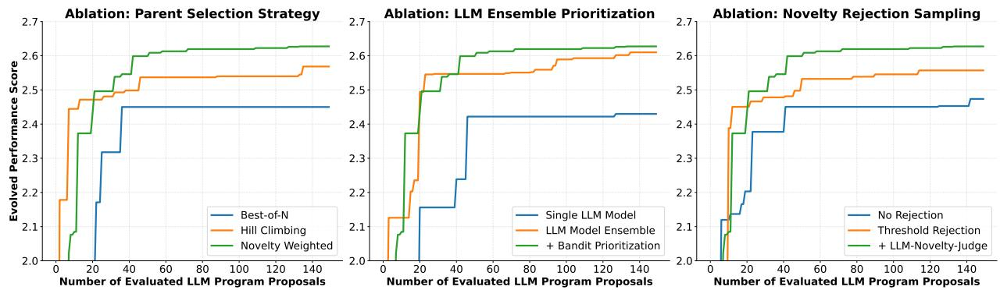  
Global-batch LBL   
ShinkaEvolve new regularization   
Figure 9 | ShinkaEvolve Method Ablation Studies on Circle Packing. Left: Weighted parent sampling outperforms random search and hill climbing. Middle: Bandit-based LLM ensembling slightly improves the performance over a fixed uniform ensemble distribution. Right: Embeddingbased rejection sampling with LLM as a novelty judge strongly outperforms no rejection sampling.

# 5. Ablations & Analysis

Impact of Parent Selection Strategies. To understand the importance of parent selection, we compare different strategies for choosing which programs to evolve. The Best-of-N baseline ignores the evolutionary history, always using the initial program as parent without feedback. In contrast, Hill Climbing represents a greedy approach that consistently selects the highest-performing program as the parent for subsequent mutations. Our proposed Weighted Sampling strategy balances exploration and exploitation by probabilistically selecting parents based on their fitness and number of offspring.

Takeaways. Weighted sampling consistently outperforms both random search and hill climbing across all tasks. Hill climbing shows strong initial performance but plateaus quickly, while weighted sampling maintains steady improvement throughout evolution. Random search demonstrates the poorest convergence, highlighting the importance of leveraging fitness-based parent selection.

Impact of LLM Ensembling and Prioritization. Evolutionary agents can benefit from diverse coding capabilities by leveraging multiple LLMs. We investigate this hypothesis by comparing a Single LLM baseline (GPT-5-nano) against ensemble approaches. The Fixed LLM Ensemble provides diversity by sampling uniformly from a predetermined set of models, while our Bandit-Based LLM Ensemble adaptively learns which models contribute most effectively to fitness improvements, balancing exploration of underutilized models with exploitation of high-performing ones.

Takeaways. The bandit-based LLM ensemble significantly outperforms both single LLM and fixed ensemble approaches. While the fixed ensemble shows moderate improvements over single LLM usage, the adaptive bandit strategy achieves the highest performance by dynamically prioritizing more effective models based on their contribution to fitness improvements.

Impact of Code Embedding-Based Rejection Sampling. Similar code variants can waste computational resources without advancing the search frontier. To address this challenge, we examine different novelty filtering mechanisms. The No Rejection Sampling baseline accepts any LLM proposal, potentially allowing near-duplicate programs to proliferate. Our Embedding-Based Rejection Sampling approach leverages text embeddings to identify and reject proposals with similarity scores exceeding 0.95. We also explore an Additional LLM-as-a-novelty-judge variant that supplements embedding-based filtering with explicit LLM assessment of program novelty.

Takeaways. Code embedding-based rejection sampling provides substantial performance gains over no rejection sampling by preventing redundant mutations. The additional LLM-as-a-novelty-judge offers marginal improvements, suggesting that embedding similarity is already an effective proxy for novelty assessment without requiring additional computational overhead.

# 6. Discussion

Summary. This work introduces ShinkaEvolve, an evolutionary framework addressing critical limitations in LLM-driven scientific discovery through improved sample efficiency and open-source accessibility. ShinkaEvolve achieves state-of-the-art results across four domains: circle packing with 150 evaluations (orders of magnitude improvement), sophisticated AIME reasoning scaffolds, ALE-Bench algorithmic improvements, and novel mixture-of-expert load balancing.

Limitations. Our implementation uses fixed configurations with limited automatic control over exploration-exploitation balance, which may vary across domains. Task specification requires manual human expertise for objective functions and evaluation. The framework is constrained to problems with well-defined numerical objectives, limiting its applicability to diverse evaluation domains.

Future Directions. Automated task specification through LLM task generation could enable greater autonomy and unlock applications in unexplored domains. Transitioning to true open-endedness, where systems generate their own objectives, represents a compelling frontier. Self-referential refinement and online meta-learning offer opportunities for continuously improving discovery.

Broader Impact & Ethical Considerations. ShinkaEvolve’s open-source release further democratizes advanced evolutionary optimization, making it accessible to researchers and practitioners previously lacking access to proprietary systems. The framework’s exceptional sample efficiency reduces computational barriers for resource-constrained environments. However, API costs from large-scale LLM usage could create economic barriers, potentially constraining democratization goals.

# Acknowledgments

We thank David Ha, Takuya Akiba, Taishi Nakamura, Luca Grilloti, Yutaro Yamada, and the rest of the Sakana AI team for helpful discussions throughout the project.

# Author Contribution List

Robert Tjarko Lange Initiated and led the project, designed the core ShinkaEvolve codebase, and implemented as well as collected results for Circle Packing, AIME, and ALE-Bench. Wrote the manuscript.

Yuki Imajuku Helped setting up the ALE-Bench infrastructure, advised on the ALE-Bench results and supported writing the manuscript section on ALE-Bench.

Edoardo Cetin Was involved in design discussions for ShinkaEvolve and came up as well as implemented the adaptive LLM sampling method and the Hydra configuration. He implemented andcollected results for LLM training and Mixture-of-Experts evolution. Co-wrote the manuscript.

# References

> Deleted for saving space
# Appendix

A Shinka Implementation Details 19   
B Task Implementation Details 20   
B.1 Circle Packing Problem . 20   
B.2 AIME Math Reasoning Agentic Harness 22   
B.3 ALE-Bench Problems 23   
B.4 Mixture-of-Experts Load Balancing Loss 24

# C ShinkaEvolve Discovered Solutions 28

C.1 Circle Packing Problem 28   
C.2 AIME Math Reasoning Agentic Harness 31   
C.3 ALE-Bench Problems 33   
C.4 Mixture-of-Experts Load Balancing Loss 52

# A. Shinka Implementation Details

• ShinkaEvolve uses a queue based implementation where LLMs generate program proposals sequentially. Afterwards, they are added to a job evaluation queue. Each proposal is based on all jobs that have completed so far and are stored in the database.

• Throughout development, we experimented with a fully asynchronous implementation that leverages both a job and a proposal queue. This allows for higher throughput but introduces a degree of "off-archiveness" in the sense that new code proposals are generated in advance and not based on all the previously submitted jobs. Furthermore, jobs from faster to query models will be executed earlier since their proposal jobs will be processed earlier. Many open research questions remain regarding the optimal trade-off between throughput, sample efficiency, and off-archiveness.

• Below we provide an overview of the Python API. It roughly adopts the high-level interface of OpenEvolve (Sharma, 2025):

Listing 1 | Minimal ShinkaEvolve configuration and usage example.

# evaluate.py - Evaluation Script

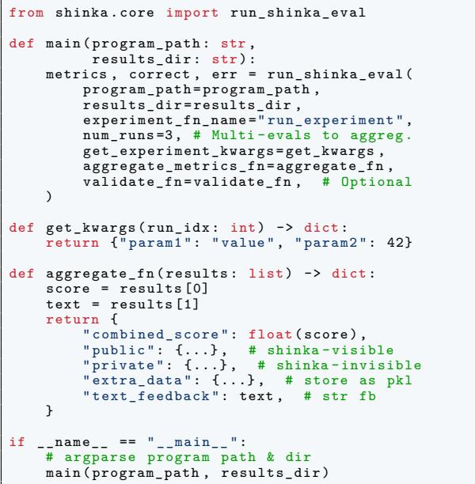

# initial.py - Starting Solution

# EVOLVE -BLOCK - START   
def advanced_algo () : # This will be evolved return solution   
# EVOLVE -BLOCK - END   
def run_experiment (\*\* kwargs ): """ Main called by evaluator """ result $=$ solve_problem ( kwargs ) return result   
def solve_problem ( params ): solution $=$ advanced_algo () return solution

# B. Task Implementation Details

> Deleted for saving space

# C. ShinkaEvolve Discovered Solutions

> Deleted for saving space